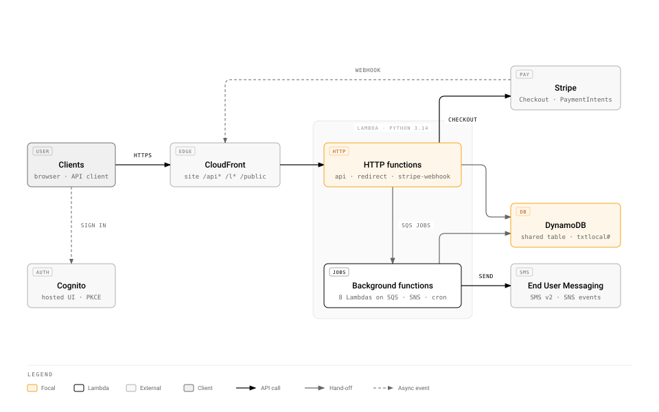
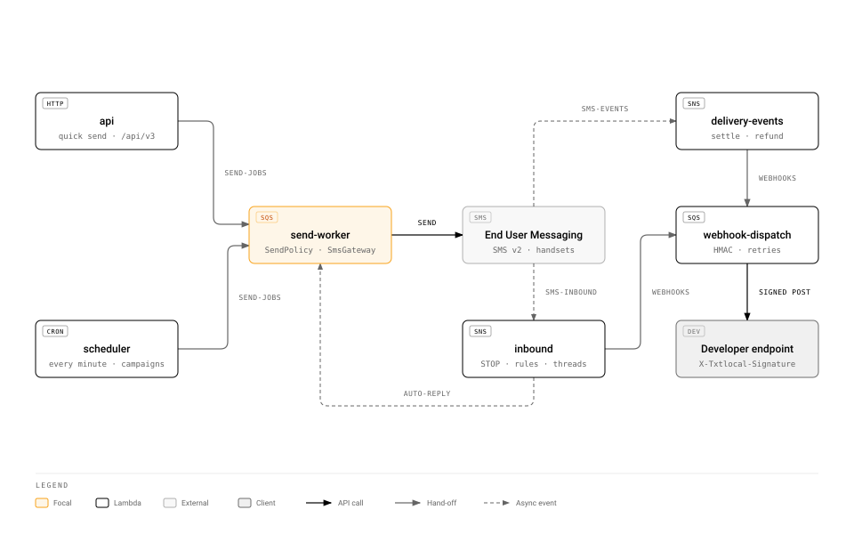

# txtlocal — SMS platform on Python, DynamoDB and Lambda

An SMS platform, UK first. An account holds a GBP balance and spends it on messages; contacts live in
lists; a message leaves from a sender the account owns or shares; replies land in an inbox and can
trigger rules; developers get an API with keys and webhooks; billing is Stripe; usage and clicks are
counted from logs. `specs/03-features.md` is the product brief, screen by screen.

The rules and the reasons behind them are in `CLAUDE.md`. The fifteen decisions and the Lambda map are
in `docs/architecture.md`. The data model and every deliberate ceiling are in
`specs/01-dynamodb-data-model.md`. The AWS resources live in the shared `https://github.com/poly-glot/aws-cloud` repository under its
$5-a-month ceiling; this repository deploys code only.

## Architecture



Every request enters through CloudFront. The site is the React page under `/txtlocal/*` in the shared
sites bucket; `/api*` goes to the `api` function (FastAPI: `/api/app` with a Cognito JWT, `/api/v3` with
Basic `username:api_key`), `/l*` to `redirect` (one `GetItem` and a `302`, cached five minutes), and
`/public` to `stripe-webhook`. Eight background functions run on SQS, SNS and EventBridge schedules. Every
function reads and writes the shared `aws-cloud` table, and every partition key starts `txtlocal#`.

Three detail views unfold what the overview groups:

| Diagram                                                          | Shows                                                                                                                                          |
|------------------------------------------------------------------|------------------------------------------------------------------------------------------------------------------------------------------------|
| [Sending, delivery and replies](diagrams/02-messaging.svg)       | `send-jobs` into `send-worker` and out through End User Messaging; delivery events and replies back over SNS; signed webhooks to the developer |
| [Top-ups, recharges and renewals](diagrams/03-billing.svg)       | Stripe Checkout, the signed webhook that credits the balance, off-session recharges and the daily renewals                                     |
| [Counting clicks and usage from logs](diagrams/04-analytics.svg) | tracked links through `redirect`, and the nightly `rollup` over CloudFront access logs and CloudWatch Logs                                     |

Each diagram's source is `diagrams/<name>.html`, drawn with the `diagram-design` skill in the
`personal-site-2026` style that `.diagram-design` pins; the `.svg` beside it is the export the docs
embed. Edit the HTML, then export the SVG again.

Every SMS passes through one port, `SmsGateway`, in one of four modes: `fake` (laptop, CI, the public
demo), `dryrun` (real API, nothing sent or billed), `sandbox` (real sends to verified numbers under AWS's
$1 a month cap) and `live`. `specs/02-sms-gateway.md` is the contract.

## Layout

```
CLAUDE.md                     the rules; binds every session and every subagent
docs/architecture.md          the decisions and the Lambda map
docs/runbook.md               deploys and SMS-mode changes
docs/testing.md               the test rules
diagrams/                     the architecture diagrams: <name>.html to edit, <name>.svg exported
specs/                        data model, SMS gateway, features, developer API, analytics, OpenAPI
pyproject.toml                uv project: ruff, mypy, import-linter, pytest
src/txtlocal/shared/          errors, model, table, telemetry, runtime, clock, money, phone, testing
src/txtlocal/slices/<slice>/  model.py, repo.py, service.py, router.py, tests/
src/txtlocal/entrypoints/     one module per Lambda, plus wiring.py, the only composition root
frontend/                     Vite + React; frontend/CLAUDE.md owns it
qa/                           scripts that prove the deployed stack; qa/README.md
scripts/check.sh              the one gate: format, lint, types, import contracts, tests
scripts/dev.sh                DynamoDB Local, seed, the API on 9000, Vite on 3000
scripts/local-table.sh        creates txtlocal-local with GSI1, GSI2 and TTL
scripts/seed.sh               seeds the local table through txtlocal.entrypoints.seed
scripts/reset-local.sh        drops the local table, recreates it and seeds it again
scripts/smoke.py              signs a fresh account in locally and asserts the whole send path
scripts/export_openapi.py     writes specs/openapi.app.json and specs/openapi.v3.json from the app
.devcontainer/                Python 3.14, Node 22, uv, rtk, codegraph, zg, DynamoDB Local
.claude/settings.json         rtk and codegraph hooks, the permission allow-list
.mcp.json                     codegraph and zvec-grep as MCP servers
.diagram-design               pins the diagrams to the personal-site-2026 style profile
.githooks/pre-commit          scripts/check.sh, then the frontend check, then index syncs
.github/workflows/            test.yml on every pull request and push; deploy.yml on main
```

The ten slices are `identity`, `billing`, `contacts`, `senders`, `messaging`, `campaigns`, `inbox`,
`automation`, `developer` and `analytics`. A slice imports another slice's `service.py` and `model.py`
only; `import-linter` fails the build otherwise.

## Configuration

Every function reads its configuration from environment variables set by `aws-cloud`, once, in
`entrypoints/wiring.py`. Reading one that was never set is a cold-start failure, so a new variable is a
pull request there first.

| Variable                                                                          | Functions                                    | Meaning                                            |
|-----------------------------------------------------------------------------------|----------------------------------------------|----------------------------------------------------|
| `TABLE_NAME`                                                                      | all                                          | the shared table                                   |
| `SMS_MODE`                                                                        | `api`, `send-worker`, `inbound`, `scheduler` | `fake`, `dryrun`, `sandbox` or `live`              |
| `SMS_CONFIGURATION_SET`, `SMS_PROTECT_CONFIGURATION_ID`, `SMS_POOL_ID`            | `send-worker`, `api`                         | the provider resources every send names            |
| `SMS_ALLOWED_COUNTRIES`, `SMS_DAILY_CAP_PER_ACCOUNT`, `SMS_MAX_PRICE_USD`         | `api`, `send-worker`, `inbound`              | the policy fences; defaults `GB`, `500`, `0.10`    |
| `SEND_QUEUE_URL`, `WEBHOOK_QUEUE_URL`, `RECHARGE_QUEUE_URL`                       | producers of each queue                      | the three queues                                   |
| `COGNITO_ISSUER`, `COGNITO_CLIENT_ID`                                             | `api`                                        | JWT verification                                   |
| `STRIPE_SECRET_KEY`, `STRIPE_WEBHOOK_SECRET`                                      | `api`, `stripe-webhook`, `billing-charge`    | secrets, never logged                              |
| `PUBLIC_BASE_URL`                                                                 | `api`, `send-worker`                         | the site, for tracked links and Stripe return URLs |
| `API_LOG_GROUP`, `SEND_LOG_GROUP`                                                 | `api`, `rollup`                              | the two log groups Logs Insights reads             |
| `ATHENA_OUTPUT`, `ATHENA_WORKGROUP`, `GLUE_DATABASE`, `GLUE_TABLE`, `LOGS_BUCKET` | `rollup`                                     | the shared analytics module                        |

Locally `.env.example` becomes `.env`; `scripts/dev.sh` sources it and forces `SMS_MODE=fake` and
`BUS=local`, so nothing on a laptop can reach AWS. Payments go to a Stripe sandbox even there;
`docs/runbook.md` section 4 has the two values `.env` needs and the `stripe listen` line.

`.env` is gitignored; the committed `.env.enc` is that file with its values encrypted by SOPS for the
age recipient in `.sops.yaml`. The matching private key is the `sops-key` secret in the
`firebase-cloud-491613` Google Cloud project, the one age key every project that encrypts this way
shares, so a fresh machine recovers `.env` with:

```bash
export SOPS_AGE_KEY="$(gcloud secrets versions access latest --secret sops-key --project firebase-cloud-491613)"
sops --decrypt --input-type dotenv --output-type dotenv .env.enc > .env
```

After changing `.env`, `sops --encrypt --input-type dotenv --output-type dotenv .env > .env.enc`
writes the file to commit.

Three things are set after the first apply, because they exist only once the resources do: the
Cognito client id and issuer into the function environment through `aws-cloud`, the Stripe webhook
signing secret once the endpoint is registered against the `stripe-webhook` URL, and the SMS
configuration set, protect configuration and pool ids once End User Messaging has them.

## How a send works



1. The page posts a quick-send request (`to`, `listIds`, `senderId`, `body`, `sendAt`) to
   `/api/app/messages/send` with the Cognito access token; a developer posts to `/api/v3/sms/send` with
   Basic `username:api_key`.
2. `messaging.service` counts segments (`GSM-7` or `UCS-2`, 1,224 characters at most), quotes the cost
   from the account's country rate, and asks `SendPolicy`: country enabled, not opted out, trial or
   topped up, balance covers the quote, daily cap not reached, sender ready. A refusal is the sentence
   the page shows.
3. `billing.service` reserves the quote with one conditional update; the message row is written
   `QUEUED` and one job goes on `send-jobs`. The answer is `202` with the message id.
4. `send-worker` takes a batch of ten, calls the gateway with `Context.messageKey` naming the row, marks
   it `SENT` with the provider id, and logs `event=message_accepted` with ids, country, parts and price
   and never the number or the body.
5. The provider publishes `TEXT_DELIVERED` or a failure to `sms-events`; `delivery-events` settles the
   row with a conditional update, refunds the quote on failure, and queues a delivery-report webhook if
   the account has a rule.
6. A reply arrives on `sms-inbound`; `inbound` attributes it to the account, moves `STOP` senders to
   the opt-out list, runs the inbound rules, and writes the conversation the Messenger shows.
7. At 02:30 UTC `rollup` groups yesterday's `message_accepted` lines into usage rows and yesterday's
   `/l/*` hits in the CloudFront access log into click rows. Both screens read rows, never logs.

## Operations

### Logs

One JSON object per line, event fields at the top level. Search by field in Logs Insights:

```
fields @timestamp, event, account_id, message_id, status, outcome, error
| filter account_id = "…"
| sort @timestamp desc
```

`api` keeps seven days, because the API Logs screen is a Logs Insights query over that group and the
product promises seven days. `send-worker` keeps 120 days, because the usage rollup reads it and History
promises four months. No log line carries a phone number, a message body, an email address or a key.

### Alarms

Three, and no more, because the platform's ten free alarms are spent: `txtlocal-api-errors` on the
function's `Errors`, `txtlocal-send-dlq` on the send dead-letter queue's visible messages, and
`txtlocal-rollup-failed` over 24 hours with missing data breaching, so a night the rollup did not run
alarms like a night it crashed. No custom metrics.

### Scheduled jobs

| Function           | When                                    | Reserved concurrency |
|--------------------|-----------------------------------------|----------------------|
| `scheduler`        | every minute                            | 1                    |
| `rollup`           | 02:30 UTC, after shorten's 02:15 rollup | 1                    |
| `billing-renewals` | 06:30 UTC                               | 1                    |

### Cost

Everything sits in the always-free tiers except three alarms (about $0.30), thirty nightly Athena
queries at the 10 MB minimum (about $0.01), a few cents of S3, and SMS spend, capped by AWS at $1.00 a
month while the account is in the sandbox and by the spend quota afterwards. About $1.40 a month at the
ceiling, on top of the platform's $0.35.

## Runbooks

### Replay a rollup day

The rollup takes `{"date": "YYYY-MM-DD"}`; both queries are idempotent and rewrite the day's rows.

```bash
aws lambda invoke --function-name txtlocal-rollup --cli-binary-format raw-in-base64-out \
    --payload '{"date":"2026-09-18"}' /dev/stdout
```

### Rotate an API key

Regenerate from Developers › API Credentials, or `POST /api/app/users/{id}/api-key`. The new key is
shown once; the old hash is gone the moment the new one is written, so any integration using it fails
closed with `401`.

### Move the AWS account out of the SMS sandbox

Open a Service Quotas case in the AWS Support Center: Account and Billing › Service Quotas › AWS End
User Messaging SMS › General Limits › quota `SMS Production Access` › new value `1`. Name the region,
the site URL, the message type, the destination countries, the opt-in process and a template. AWS
answers within a day. Until then `SMS_MODE=sandbox` sends only to the ten verified numbers under the
$1.00 cap, which is what a trial cohort should be doing anyway.

### Raise the spend quota

```bash
aws pinpoint-sms-voice-v2 describe-spend-limits
```

shows the enforced and maximum monthly SMS spend. Raising the maximum is a Service Quotas increase on
the same category; raising the enforced limit up to that maximum is `set-text-message-spend-limit-override`.
Raise it deliberately, in a step the budget can absorb, and never above what the month's trial cohort
can spend.

## Scalability and its ceilings

The register is the last section of `specs/01-dynamodb-data-model.md`; the gateway's own ceilings close
`specs/02-sms-gateway.md`. The headline: the table is 25 read and 25 write units shared with two other
apps, so the send worker is paced at a concurrency of two, roughly five messages a second, and the
first upgrade is a dedicated on-demand table, about $0.10 a month at demo volume.

## Dev container

There is no Python and no Node on the host. Open the repository in the dev container and everything is
there: Python 3.14, `uv`, Node 22 with `pnpm`, `rtk`, `codegraph`, `zg`, the AWS and GitHub CLIs, Claude
Code, and DynamoDB Local as a sibling service at `http://dynamodb:8000`. `post-create.sh` runs `uv sync`,
installs the frontend, initialises `rtk`, builds the `codegraph` and `zg` indexes, creates the table and
installs the pre-commit hook. `.venv` and `frontend/node_modules` are named volumes, so a rebuild keeps
them.

Off-container, the same environment runs with:

```bash
docker compose -f .devcontainer/docker-compose.yml run --rm --service-ports app bash
```

Exploration goes through the indexes before it goes through files: `codegraph explore "<symbols or
question>"` for structure and call paths, `zg query "<what you are looking for>"` when you do not know
the name, `rtk grep` for an exact string. `rtk gain` shows what the hook saved.

## Run it locally

```bash
scripts/dev.sh
```

starts DynamoDB Local if nothing answers on 8000, creates `txtlocal-local`, seeds the platform rows,
serves the API on 9000 with `SMS_MODE=fake` and `BUS=local`, and runs the Vite dev server on 3000
proxying `/api` to 9000, which is what CloudFront does in production. Open `http://localhost:3000`.

There is no Cognito on a laptop. With `DEV_IDP_USERS` set, the API mounts a local OpenID provider at
`/api/dev-idp` and the page's ordinary authorization-code flow with PKCE runs against it: the sign-in
page is a picker of those addresses, and choosing one for the first time creates the account, its
£2.00 fourteen-day trial and its shared sender. Tokens live in memory only, so a page reload
round-trips through the picker; that is the design, not a bug.

In `fake` mode nothing reaches a network. Every send is answered at once and its delivery event is
chosen by the destination's last two digits: `00` invalid, `01` unreachable, `02` blocked, `03` spam,
anything else delivered. Own-number verification accepts `000000`. The in-process bus runs the send
worker and the delivery events inline, so a message reaches `DELIVERED` or `FAILED` before the request
returns.

```bash
scripts/smoke.py
```

signs a fresh account in through that provider and asserts the whole path: the trial credit and the
shared sender, a two-recipient quote at the GB rate, the send, one `DELIVERED` row and one `FAILED`
row in History, and the debited balance. Give it a user the provider knows:

```bash
DEV_IDP_USERS="demo@txtlocal.local,smoke@txtlocal.local" scripts/dev.sh
SMOKE_USER=smoke@txtlocal.local uv run python scripts/smoke.py
```

The pieces separately:

```bash
scripts/local-table.sh
uv run python -m txtlocal.entrypoints.seed
uv run python -m txtlocal.entrypoints.dev_server
pnpm --dir frontend dev
```

The API runs through `dev_server` rather than the `uvicorn` command line because every client shares
the one event loop `shared.runtime` owns; `uvicorn` would make its own and the `aioboto3` clients
built at start-up would belong to the wrong one.

## Frontend

`frontend/` is Vite, React 19 and TypeScript strict with React Router, TanStack Query and CSS Modules.
`src/screens/` holds one folder per URL, each screen with its parts, its tests and its pure rules in
`rules.ts`; `src/app/` wires the providers, the route table and the frame every signed-in page sits in;
`src/components/` holds the generic components. The client in `src/api/` is typed from
`specs/openapi.app.json` through `openapi-typescript` and `openapi-fetch`, so no endpoint has a
hand-written wrapper. The generated `src/api/generated/dashboard.d.ts` is committed, and `check:api`
fails when it no longer matches the spec. `pnpm --dir frontend check` runs `tsc`, ESLint, Prettier,
Vitest and `check:api`; `frontend/CLAUDE.md` holds the rules.

## Deploy

`.github/workflows/deploy.yml` runs on every push to `main`. It builds one zip on an arm64 runner —
`uv export` for the locked dependencies, `uv pip install --target` for `aarch64-manylinux2014` wheels,
`src/txtlocal` on top — assumes `AWS_DEPLOY_ROLE_ARN` through GitHub's OIDC provider, and calls
`aws lambda update-function-code` once per function; the eleven functions share the artifact and differ
only in their handler. It then builds the page and syncs `frontend/dist` to
`s3://$SITES_BUCKET/txtlocal/` and invalidates the distribution.

The repository needs one secret and four variables, all from the `outputs` artifact of the `aws-cloud`
apply:

```bash
gh secret set AWS_DEPLOY_ROLE_ARN -R poly-glot/txtlocal --body "$(jq -r .apps.value.txtlocal.deploy_role_arn outputs.json)"
gh variable set SITES_BUCKET      -R poly-glot/txtlocal --body "$(jq -r .apps.value.txtlocal.sites_bucket outputs.json)"
gh variable set DISTRIBUTION_ID   -R poly-glot/txtlocal --body "$(jq -r .apps.value.txtlocal.distribution_id outputs.json)"
gh variable set COGNITO_CLIENT_ID -R poly-glot/txtlocal
gh variable set COGNITO_DOMAIN    -R poly-glot/txtlocal
```

The zip must stay under the 50 MB direct-upload limit; the workflow fails loudly when it does not, and
the fix is uploading through S3 with `--s3-bucket`, not trimming dependencies by hand.

## Test

```bash
bash scripts/check.sh
pnpm --dir frontend check
```

The first runs `ruff format --check`, `ruff check`, `mypy --strict`, `lint-imports` and `pytest`; the
integration tests run against DynamoDB Local when `AWS_ENDPOINT_URL_DYNAMODB` is set and print a skip
notice otherwise. `.github/workflows/test.yml` runs both with a DynamoDB Local service container on every
pull request and push to `main`, so the integration tests run rather than skip. `.githooks/pre-commit`
runs the same two before every commit, then refreshes the `codegraph` and `zg` indexes. `docs/testing.md`
owns the rules a test follows.
