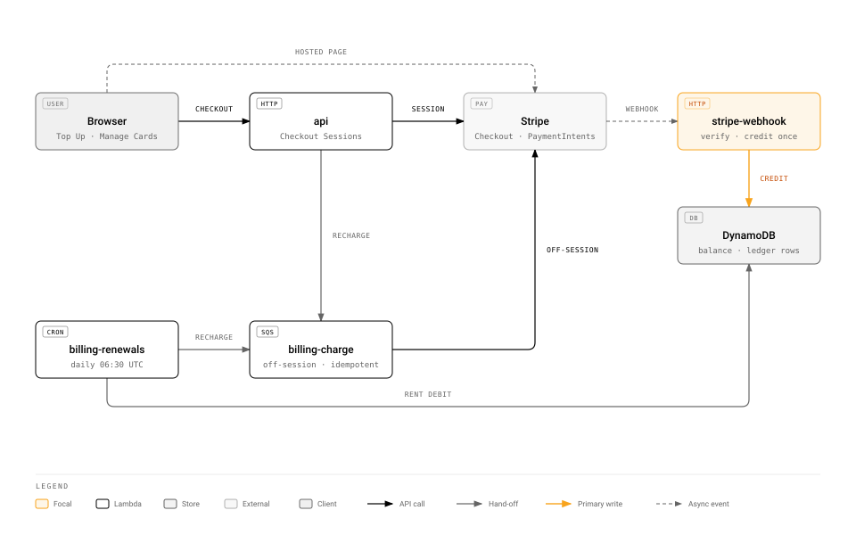
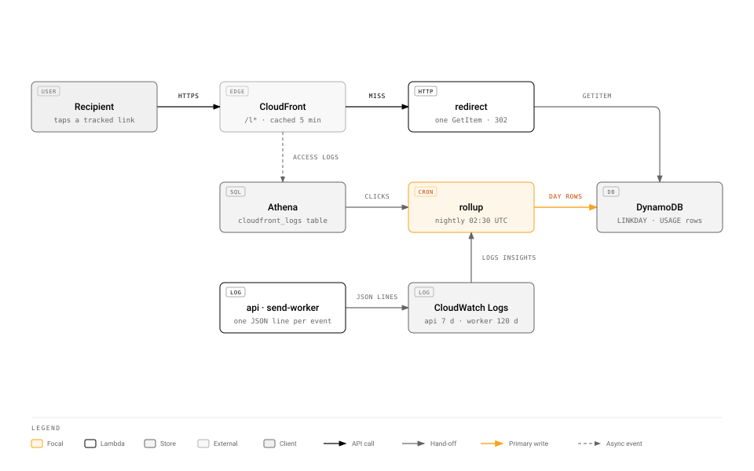

# Architecture

txtlocal is an SMS platform, UK first: an account holds a GBP balance and spends it on messages;
contacts live in lists; a message goes out from a sender the account owns or shares; replies land in an
inbox and can trigger rules; developers get an API with keys and webhooks; billing is Stripe; usage and
clicks are counted from logs. `specs/03-features.md` is the product brief. The backend is Python 3.14
on Lambda, arm64, one shared DynamoDB table; the frontend is a React single-page app on CloudFront; SMS
goes through AWS End User Messaging behind one port. Everything runs inside the shared `aws-cloud`
account and its $5-a-month ceiling.

## 1. Decisions

Each decision names the alternative it beat in one line. Reopen one by editing this file, never by
writing code that quietly assumes the alternative.

1. **Runtime: Python 3.14 managed runtime on arm64, 256 MB.** `uuid.uuid7()`, `StrEnum`, `match` and
   `asyncio` are all stdlib. No container images and no layers: a zip built by `uv export` keeps the
   cold start under a second and the deploy a single `update-function-code`. Rejected: 3.13 (loses
   `uuid7`), containers (slower cold start, ECR bills), Powertools layer (one more moving part).
2. **HTTP: one `api` Lambda running FastAPI under Mangum on a function URL behind CloudFront `/api*`.**
   Every slice exposes an `APIRouter`; the dashboard face lives under `/api/app/*` with a Cognito JWT
   and the developer face under `/api/v3/*` with HTTP Basic `username:api_key`. FastAPI gives pydantic
   validation, dependency-injected auth and OpenAPI for the developer docs page for free. Rejected:
   Powertools resolvers (synchronous, and the repositories are async); API Gateway (bills, and the
   platform serves function URLs through CloudFront already).
3. **Async services and repositories, exactly the shape of `examples/raffle_draw.py`.** `aioboto3`
   for DynamoDB, SQS, SNS and `pinpoint-sms-voice-v2`; one event loop per process, kept in
   `shared/runtime.py`, so clients survive warm invocations. Rejected: synchronous boto3 (simpler, but
   the reference example is the bar and campaign fan-out benefits from concurrency).
4. **Persistence: the shared `aws-cloud` table, `key_prefix = "txtlocal#"`, GSI1 `(GSI1PK, GSI1SK)`
   and GSI2 `(GSI2PK)` overloaded, TTL on `ttl`.** Every partition key value goes through
   `table.partition`. Money is integer micro-pounds (`_micro`), because a UK SMS costs £0.0427 and
   pence cannot hold it. Ids are `uuid7` strings. Rejected: a dedicated table (bills from the first
   write; it is the named upgrade when the shared 25 units run out).
5. **SMS: AWS End User Messaging SMS v2 behind `SmsGateway`, with four modes chosen by `SMS_MODE`.**
   `fake` (local, CI, the public demo), `dryrun` (real API, `DryRun=true`, nothing sent, nothing
   billed), `sandbox` (real sends to verified numbers under AWS's $1 a month cap) and `live`. A pure
   `SendPolicy` fences every mode: destination country allow-list, opt-out list, per-account daily cap,
   `MaxPrice` on every call. `specs/02-sms-gateway.md` is the contract. Rejected: SNS `Publish`
   (no sender IDs, no delivery events, US-only free tier); Pinpoint v1 (end of support 30 October 2026).
6. **Asynchronous work rides SQS standard queues with dead-letter queues.** `send-jobs` (one message
   per recipient, batch 10, maximum concurrency 2), `webhooks` (one per delivery attempt) and
   `recharge` (one per auto top-up). The event source mapping's concurrency is what paces DynamoDB
   writes and SMS message parts per second. Locally `LocalBus` calls the worker in-process. Rejected:
   Step Functions (bills per transition), EventBridge Scheduler per campaign (fine, but a one-minute
   poll is fewer resources and the siblings' pattern), Lambda async invoke (no batching, no dead
   letters without extra wiring).
7. **Provider events arrive on SNS topics and are addressed by `Context`.** The configuration set's
   event destination publishes delivery events to `sms-events`; a two-way number publishes inbound
   messages to `sms-inbound`. Every `SendTextMessage` carries `Context.messageKey`, the row's own key,
   so a delivery event is one conditional update with no lookup. Rejected: Kinesis Data Firehose
   (bills), CloudWatch Logs destination (would need a query to find the row).
8. **Scheduling is a one-minute poll.** `scheduler` (reserved concurrency 1) queries GSI2 partition
   `txtlocal#DUE` for `SK <= now`, claims each campaign with a conditional SCHEDULED to SENDING flip,
   and fans it out to `send-jobs`. `billing-renewals` runs daily at 06:30 UTC and `rollup` nightly at
   02:30 UTC, after shorten's 02:15 rollup so two paced writers never share the table at once.
9. **Analytics is the shorten pattern three times over, in one `rollup` Lambda, with no write in a
   request path.**
   - Tracked-link clicks: `/l/{code}` is served by `redirect`, one eventually consistent `GetItem`
     and a `302` with `Cache-Control: public, max-age=300`; clicks are counted from CloudFront standard
     logs through the shared `aws_cloud.cloudfront_logs` Athena table into `LINKDAY` rows.
   - Usage and reporting: `send-worker` logs one `event=message_accepted` line per message (ids,
     product, sender id, country, parts, price, never the number or the body); the nightly rollup runs
     one CloudWatch Logs Insights query grouping yesterday by account, sub-account, product, sender and
     country and writes `USAGE` day rows, paced. The Usage tab sums day rows; the Reporting tab reads
     them. Usage is next-day; the ceiling and its upgrade path are in the data model spec.
   - API logs: `api` logs one `event=api_request` line per developer-API call; the API Logs screen
     runs Logs Insights over the `api` log group, whose retention is seven days, exactly the retention
     the screenshot promises. No rows are written.
   Rejected: per-request counters in DynamoDB (a write per call on a table shared three ways),
   Firehose to S3 (bills), a dedicated analytics store.
10. **Auth: one Cognito user pool with self sign-up, hosted UI, authorization code with PKCE.** The
    SPA holds the access token; `api` verifies RS256 against the cached JWKS with `PyJWT`. The user
    row maps username to account and role; sub-accounts are further users in the same pool created
    with `admin_create_user`. The developer API authenticates Basic `username:api_key`, finds the user
    by the key's SHA-256 through GSI2 and compares in constant time. Keys are shown once at creation
    or regeneration, a deliberate departure from the screenshot, which shows keys in the clear.
    Rejected: custom login pages (auth UI is not the product), custom attributes (the user row already
    holds the mapping). Locally there is no Cognito: when `DEV_IDP_USERS` is set, `wiring.py` mounts
    `identity.dev_idp`, a hundred-line OpenID provider under `/api/dev-idp` with `/oauth2/authorize`,
    `/oauth2/token` and a JWKS, signing RS256 tokens with a key made at start-up, so the SPA's PKCE
    flow and the API's verification run unchanged against it. The first authenticated request creates
    the account and a `SUB#{sub}` pointer row from the ID token's `sub` and `email`.
11. **Payments: Stripe over `httpx`, the donation shapes.** A top-up is a Checkout Session in payment
    mode with `invoice_creation` on, so the Transactions tab lists Stripe's invoice number and hosted
    URL and nothing is rendered here. A saved card is a Checkout Session in setup mode. The webhook
    verifies the signature by hand, answers 200 for terminal outcomes and 500 for retryable ones, and
    credits the balance in one transaction with the ledger row and an `EVENT#{id}` put-if-absent.
    Auto-recharge is an off-session PaymentIntent from `billing-charge` with an idempotency key of
    account and hour. Trial credit is a £2.00 ledger row; `can_send` is
    `has_topped_up or now < trial_ends_at`, and unused trial credit is never clawed back. Rejected:
    the `stripe` SDK (large, and three endpoints do not need it), Stripe Subscriptions (nothing here
    recurs except number rental, which is a ledger debit).
12. **Email is SES and arrives in phase 6.** Outbound: low-balance alerts, the `EMAIL_USER` and
    `EMAIL_FIXED` rule actions, sub-account invitations. Inbound email-to-SMS is an SES receipt rule
    to SNS in phase 7. Until then no email is sent and Cognito's own sender handles verification.
13. **Frontend: Vite, React 19, TypeScript strict, React Router, TanStack Query, CSS Modules.**
    Types come from the dashboard OpenAPI through `openapi-typescript`, so the two sides cannot drift.
    ESLint with `typescript-eslint` strict type-checked rules, `react-hooks` and `jsx-a11y`; Prettier;
    Vitest with Testing Library. Built once, synced to `s3://<sites>/txtlocal/`, invalidated on
    deploy. `frontend/CLAUDE.md` holds the rules. Rejected: Next.js (a server for a static app),
    Biome (no type-aware rules).
14. **Tooling is a hard requirement.** `uv` owns the environment; `ruff` formats and lints;
    `mypy --strict` types; `import-linter` enforces slice boundaries; `pytest` runs unit tests always
    and DynamoDB Local integration tests when the endpoint is set. `scripts/check.sh` is the one gate,
    wired as the git pre-commit hook and as CI. `rtk` filters command output, `codegraph` answers
    structure questions, `zg` answers "where is the code that…" questions, all installed in the dev
    container. No Python and no Node on the host.
15. **No infrastructure in this repository.** `terraform/apps/txtlocal.tf` in `aws-cloud`, plus the
    module extensions `tasks/plan.md` lists, is the whole surface; this repository deploys code with
    the role that module outputs.

## 2. Lambdas

| Function | Trigger | Timeout | Concurrency | What it may touch |
|---|---|---|---|---|
| `api` | function URL, `url = "api"` | 29 s | default | table, `send-jobs`, `recharge`, Logs Insights on its own group, SMS (verification codes, dry runs), Stripe, Cognito admin |
| `redirect` | function URL, `url = "l"` | 5 s | default | table, read only |
| `stripe-webhook` | function URL, `url = "public"` | 10 s | default | table |
| `send-worker` | SQS `send-jobs`, batch 10, max concurrency 2 | 60 s | default | table, SMS send, `webhooks` |
| `delivery-events` | SNS `sms-events` | 30 s | default | table, `webhooks` |
| `inbound` | SNS `sms-inbound` | 30 s | default | table, `send-jobs`, `webhooks` |
| `scheduler` | `rate(1 minute)` | 60 s | 1 | table, `send-jobs` |
| `webhook-dispatch` | SQS `webhooks`, batch 1, max concurrency 2 | 30 s | default | egress only |
| `billing-charge` | SQS `recharge` | 60 s | 1 | table, Stripe |
| `billing-renewals` | `cron(30 6 * * ? *)` | 900 s | 1 | table, `recharge`, SMS number release |
| `rollup` | `cron(30 2 * * ? *)` | 900 s | 1 | table, Athena, Glue, logs bucket, Logs Insights |

The same functions, path by path:

Alarms, three and no more, about $0.30 a month because the platform's ten free alarms are spent:
`txtlocal-api-errors` on `AWS/Lambda Errors`, `txtlocal-send-dlq` on the send dead-letter queue's
`ApproximateNumberOfMessagesVisible`, and `txtlocal-rollup-failed` over 24 hours with missing data
breaching. Custom metrics: none. Every alarm watches a metric AWS already publishes.

## 3. Slices

| Slice | Owns | Screens |
|---|---|---|
| `identity` | account, users, sub-accounts, sign-in mapping, profile, messaging settings | Profile, Account Settings, Subaccounts, Messaging Settings › General |
| `billing` | balance, ledger, rates and packs, top-ups, cards, auto-recharge, renewals, transactions | Billing › all seven tabs |
| `contacts` | lists, contacts, opt-out list, import, clean up | Contacts |
| `senders` | smart senders, own numbers with verification, shared pool, dedicated numbers, alpha tags | Sender IDs › all, Buy A Number |
| `messaging` | segments and encoding, cost quote, quick SMS, quick MMS, templates, history, the gateway | Quick SMS, Quick MMS, Templates, History |
| `campaigns` | campaign lifecycle, scheduling, fan-out, per-campaign counts, opt-out footer | SMS Campaign, MMS Campaign |
| `inbox` | conversations, inbound threading, replies | Messenger |
| `automation` | inbound rules and actions, delivery report rules, website registration, email-SMS allowed addresses | Webhooks, Website Registration, Email SMS |
| `developer` | API keys, the `/api/v3` face, API logs, webhook signing and dispatch | API Credentials, API Logs |
| `analytics` | tracked links, redirect, rollup queries, usage and click reads | Usage, Usage Reporting, campaign click counts |

A slice is `model.py`, `repo.py`, `service.py`, `router.py` and `tests/`. Another slice may import
`service.py` and `model.py` and nothing else; `import-linter` fails the build otherwise. Concrete
adapters, the gateway, the bus, the clock and the repositories, are constructed in
`entrypoints/wiring.py` and nowhere else.

## 4. Local development

`scripts/dev.sh` starts DynamoDB Local, creates the table and seeds a demo account, runs `uvicorn` on
9000 with `SMS_MODE=fake` and `BUS=local`, and runs the Vite dev server on 3000 proxying `/api` to 9000,
which is what CloudFront does in production. The fake gateway answers every send with a synthetic
provider id and a delivery event chosen by the destination's last two digits, so History shows
delivered, failed and unreachable rows without a network. `POST /api/app/demo/inbound` injects an
inbound message and exists only when `SMS_MODE=fake`. Nothing here can reach AWS. Top-ups and
cards go to a Stripe sandbox; `docs/runbook.md` section 4 has the `.env` values and the
`stripe listen` line that delivers its events.

## 5. Cost

| Item | Monthly |
|---|---|
| Lambda, SQS, SNS, DynamoDB, CloudFront, Cognito, Logs, Glue, EventBridge | $0 inside the always-free tiers |
| Three alarms | $0.30 |
| Athena, thirty nightly queries at the 10 MB minimum | $0.01 |
| S3 site, logs and Athena results | under $0.05 |
| SMS in `sandbox` mode | at most $1.00, enforced by AWS |
| SES, from phase 6 | pennies |

About $1.40 a month at the ceiling, on top of the platform's existing $0.35. The number that can move
is SMS spend, which is why `live` mode keeps the account spend quota low and raises it deliberately.
